# CoShop


A storefront built for the **OpenAI WebMCP Challenge** — where a shopper and their
AI agent browse, compare, and check out in the *same session*, watching each
other work.

Most agentic-commerce demos are one of two things: a static catalog with a
chat widget bolted on, or an agent that silently completes a purchase while
the human watches a spinner. CoShop is neither. Every WebMCP tool call is
grounded live in the UI — the exact product card or cart line the agent just
touched scrolls into view and pulses — and the one truly consequential action,
placing an order, is never completed by the agent alone. The agent can
**prepare** a checkout and even **withdraw** it, but only the human can
**confirm** it, via a live banner that appears wherever they're standing in
the app. It's the difference between an agent that acts *on* the storefront
and an agent that acts *with* you in it.

## Why this matters

Real agentic checkout — the kind merchants will actually ship — needs a human
sign-off gate for the same reason two-factor auth exists: an agent should be
able to do the tedious 90% (search, compare, fill the cart, apply the code)
autonomously, but the "place a real order with real money" step is exactly
where you want a deliberate, visible human decision. CoShop's confirm/decline
mechanic is a small, concrete model of that — not a toy restriction, but the
shape a production agentic-checkout flow would actually need.

## The WebMCP Workflow

```mermaid
sequenceDiagram
    participant User as Human Shopper
    participant AI as AI Agent
    participant App as CoShop React App
    participant State as Zustand & API
    
    User->>AI: "Find a waterproof boot, add it, and checkout"
    App->>AI: Registers WebMCP Tools (document.modelContext)
    
    AI->>App: Executes search_products("waterproof")
    App->>State: Fetches Catalog Data
    State-->>App: Returns JSON Results
    
    AI->>App: Executes add_to_cart(id, size, qty)
    App->>State: Mutates Cart State
    State-->>App: Triggers "Live Grounding" UI animations
    
    AI->>App: Executes checkout()
    App->>User: Renders Human-in-the-Loop Confirmation Banner
    User->>App: Physically Clicks "Confirm Order"
```



## Example Walkthrough: The Shared Session

Imagine you are shopping for a hiking trip. You manually browse the catalog, find the *Urban Glide Sneakers*, and add them to your cart. Then, you realize you also need a waterproof jacket. Instead of scrolling and searching for it yourself, you open your WebMCP-enabled AI agent and type:

> *"I just added sneakers to my cart. Can you find me a waterproof jacket under $150, add a size Medium to the cart with my sneakers, and stage a checkout?"*

Here is exactly what happens behind the scenes:
1. **Tool Discovery:** The agent reads the page's `document.modelContext` and instantly identifies the `search_products`, `add_to_cart`, and `checkout` tools.
2. **Search Execution:** The agent autonomously executes `search_products("waterproof jacket")`. The CoShop API processes this and returns the structured catalog data to the agent.
3. **Live UI Grounding:** The agent executes `add_to_cart(jacketId, "M", 1)`. Because this WebMCP tool modifies the exact same **Zustand** state store as the human-facing UI, your cart sidebar instantly slides open on your screen, and you watch the jacket appear right next to the sneakers you added manually.
4. **Human Validation:** The agent executes `checkout()`. The AI is explicitly prevented from spending your money autonomously. Instead, it pauses, and a global "Confirm Order" banner appears on your screen. You review the combined order, click "Confirm," and safely complete the transaction.

## What's built

- **16-item product catalog** across Shoes and Apparel, browsable and
  searchable by a human or an agent identically.
- **11 WebMCP tools**, registered via `document.modelContext` and backed by
  the same API routes and shared state the human-facing UI uses — an agent
  and a person are never working off two different sources of truth:
  - `search_products`, `filter_products`, `get_product_details`,
    `compare_products` — read-only discovery tools.
  - `add_to_cart`, `remove_from_cart`, `view_cart`, `apply_discount_code` —
    cart mutation, fully autonomous.
  - `checkout` — **stages** an order and hands it to the shopper; does not
    place it.
  - `cancel_checkout` — lets the agent withdraw a checkout it staged.
  - `get_order_status` — look up a placed order.
- **Live agent grounding.** Every tool call that touches something on screen
  (a product card, a cart line, the discount box) scrolls it into view and
  pulses it, so "the agent just did something" is never just a toast — you
  can see exactly what.
- **Human-in-the-loop checkout.** When the agent calls `checkout`, a
  confirmation banner appears globally, on whatever page the shopper is on,
  with the order total and two buttons only a human can click: confirm or
  decline. The shopper's own manual "Checkout" button in the cart is
  unaffected — the gate exists specifically for the agent → human handoff.
- **A visible activity log** (`aria-live`, styled as captions) narrating every
  tool call in order — both a demo aid and a genuine accessibility feature: a
  non-visual user gets the same "I can see what the agent is doing" signal a
  sighted user gets from watching the UI move.
- **Accessible by default** — semantic HTML, ARIA labels, skip-to-content,
  visible focus states, and live regions throughout, not bolted on after.
- **8K Photorealistic Product Assets** — Integrated directly into the `/public/images` 
  directory to give the application a premium, production-ready aesthetic.
- **Framer Motion throughout** — staggered catalog entrance, card hover/tap,
  animated cart add/remove, and a cart badge that pops on change.

## Tech stack & Technical Depth

- **Next.js 16 (App Router)**: Server-side rendering and edge-compatible API routes.
- **`use-webmcp-tool`**: Official React hook mapping schema definitions to `document.modelContext` for client-side tool discovery.
- **Zustand State Management**: The core architectural bridge. By passing WebMCP `execute()` callbacks through the exact same Zustand store that powers the React UI, we ensure absolute consistency (one store, one source of truth).
- **Tailwind CSS v4 & Framer Motion**: Powering the "Midnight Violet" glassmorphism aesthetic and fluid state transitions.
- **Stateless Architecture**: Cookie-backed cart/order storage (no external database). This ensures massive scalability for demo environments without bottlenecking on database reads/writes, remaining entirely stateless and serverless on Vercel's Edge network.

## Running locally

```bash
npm install
npm run dev
```

Open [http://localhost:3000](http://localhost:3000). No environment
variables or external services are required — the catalog is seeded in code
and cart/order state lives in an httpOnly cookie per session.

To exercise the WebMCP tools with a real agent rather than the UI:

- **ChatGPT's in-app browser** (Recommended):
  Navigate the desktop app to the deployed URL and ask it to shop — e.g. *"find me a
  waterproof running shoe under $120, add it to my cart, and check out."*
  Watch it stage the order, then confirm it yourself in the UI.
- **Chrome**: enable `chrome://flags/#enable-webmcp-testing`, then use an
  agent-driven browsing surface that speaks WebMCP against the running app.

## Project structure

```
app/                 Routes: browse, product detail, cart, order confirmation
components/          UI components + WebMCPTools.tsx (all tool registrations)
store/cart-store.ts  Shared Zustand store — cart, spotlight, pending checkout
lib/                 Catalog data, formatting helpers, placeholder art, cookie cart
app/api/             Cart, discount, checkout, and order-status routes
public/images/       8K photorealistic product image assets
```

## License

MIT — see [LICENSE](./LICENSE).
